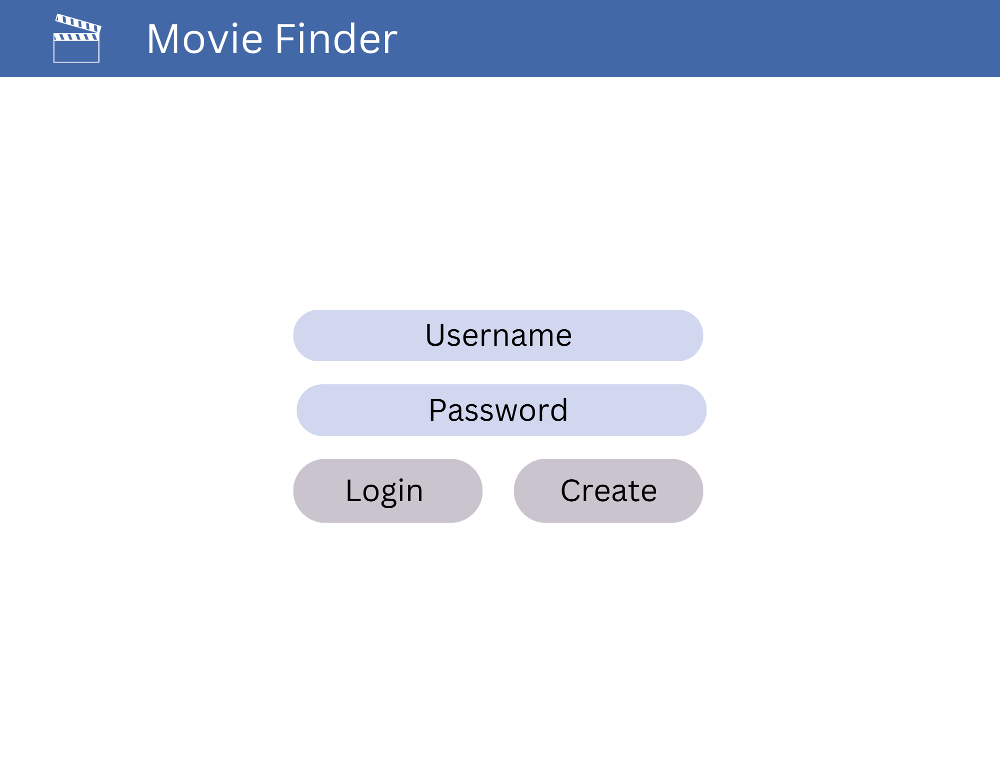
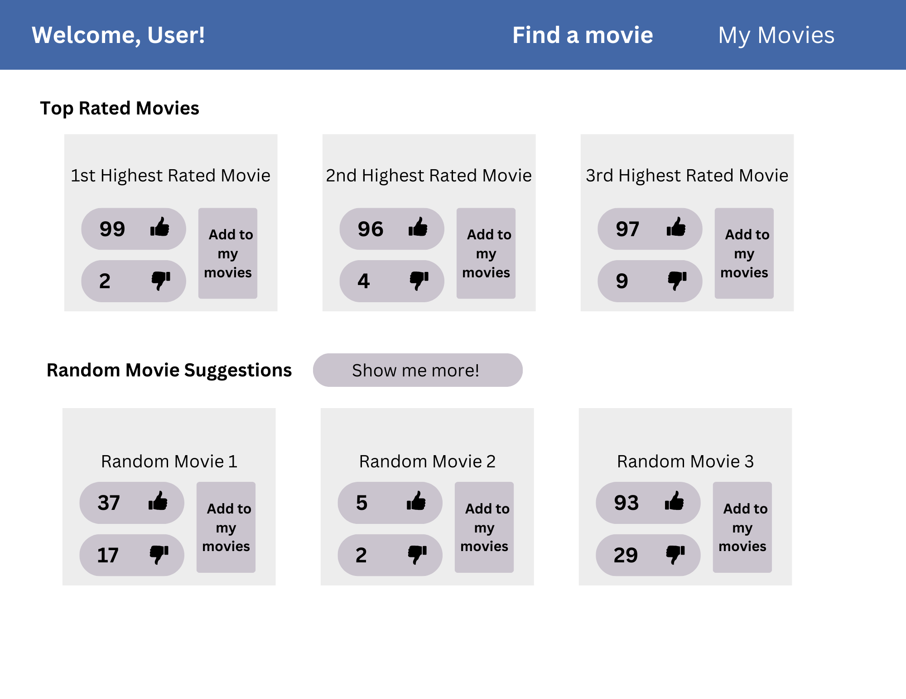
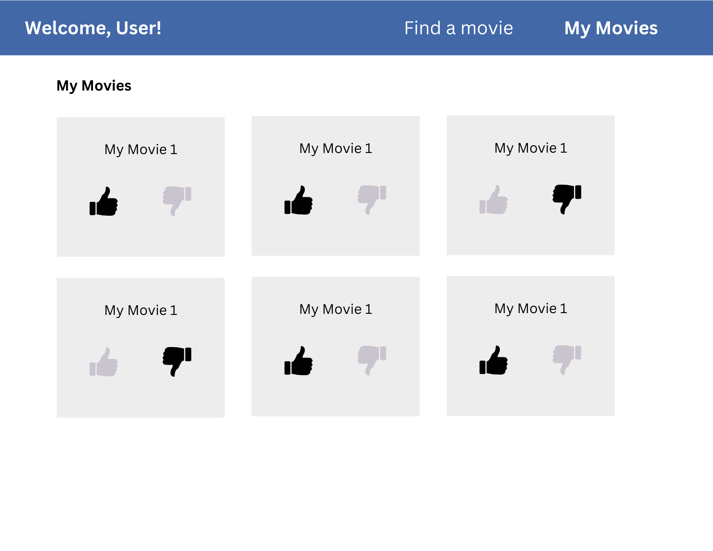

# Movie Finder

## Product Overview
How often do you find yourself purusing through Netflix with no clue what to watch? Movie Finder makes it easy to discover something new to watch. Request a random movie suggestion, or browse the top rated movies from other Movie Finder users. After you watch a movie, you can upvote it or downvote it to help others enjoy (or avoid) the same movies as you.

## Design
### User Login  
  

### Movie Finder

### Saved Movies

## Key Features  
- Secure login over HTTPS
- Ability to upvote and downvote movies
- Today's top movies displayed in real time
- Movie upvotes and downvotes upvoted in real time
- Ability to save movies to user profile
- Ability to retrieve and display random movies from database
- User's saved movies are persistently stored in a database

## Technologies
I will use the technologies in the following ways:  

**HTML** - Uses HTML for basic structuring and organization across three HTML pages. One HTML page for user login. One page for movie suggestion generation. One page for saved movies.  
 
**CSS** - Uses CSS for basic styling and animation for all display sizes. Create accessible and appealing designs.  

**JavaScript** - Uses JavaScript for the following:
- User login and authentication.  
- Retrieving random movies.  
- Retrieving top rated movies.  
- Submitting user vote of a movie.  

**Authentication** - Users will create an account and login. Within their account, they will have access to the movies that they have reviewed. They can also get random movie suggestions and view top rated movies.  

**Database Data** - Stores a user's saved movies and a list of available movies.  

**WebSocket Data** - Top rated movies are broadcasted as users upvote and downvote movies. All movie upvotes and downvotes are updated in real time.  

## HTML Deliverable
For this deliverable, I built out the webpage structure using HTML.  
- HTML Pages - Three HTML pages that allow the user to login, find movie suggestions, and view saved movies.  
- Links - The login page automatically links to the movie suggestions page, and all pages appropriately link to each other.  
- Textual Content - Page titles and user instructions are represented as text.  
- Third Party - The "generate movies" button will pull random movies from a movie API.
- Images - Each movie suggestion is represented by an image pulled from the internet.  
- Login - The home page contains a login placeholder that redirects the user to the "Find Movies" page upon login.
- Database Data - The movies on the "Saved Movies" page represent data stored in the database.
- WebSocket Data - The movies on the "Find Movies" tab, along with their user scores, represent websocket data that will be updated in real time.

## CSS Deliverable
For this deliverable, I properly styled the application into its final appearance.
- Header, footer, and main content body  
- Navigation elements - I added stylization and formatting to the navigation bar.  
- Responsive to window sizing - Elements scale and resize depending on window sizing.  
- Application elements - Updated styling and made elements responsive to interactions like hovering.  
- Application text content - Consistent fonts and sizing for appropriate elements.  
- Application images - Added consistent image sizing and aspect ratio.

## JavaScript Deliverable
For this deliverable, I added functionality to the application and added placeholders for future technologies.  
- Login -  When you enter your name on index.html, it stores your name in local storage to use for database queries.  
- Database - Users can save movies. When they save a movie, it is stored in local storage.   
- WebSocket - Users can like and dislike movies, which updates the like count. I created placeholder functions getLikeCount and getDislikeCount that will be replaced with live WebSocket data.  
- Logic - Added functionality to generate random movies, which queries local storage for 3 random movies.  

## Service Deliverable
For this deliverable, I added functionality to the application and added placeholders for future technologies.  
- Node / Express - Done.    
- Static Middleware for Frontend - Done.  
- Calls to Third Party Endpoints - Instead of loading .jpg files into the public folder, the application calls a third party endpoint to get several hundred movies and their posters upon load.  
- Backend Service Endpoints - Created post and delete endpoints for saving and removing movies from a users list.  
- Frontend Calls Service Endpoints - Upon load, the application calls the loaded movies and saved movies endpoints to get the Top Movies and Random Movies.  

## Database Deliverable  
For this deliverable, I added database support for saving movies and updating like counts.  
- MongoDB Atlas DB created - Done.  
- Endpoints for data - Endpoints now process the data and send it to Mongo.  
- Stored data in MongoDB - Done.  

## Login Deliverable  
For this deliverable, I authenticate the user and associate actions with that user.
- User registration - Creates a new account in the database.
- Existing User - Authenticates user at login.
- Use MongoDB to store credentials - Stores users and retrieves credentials at login.
- Restricts functionality - All functionality requires a valid auth token.